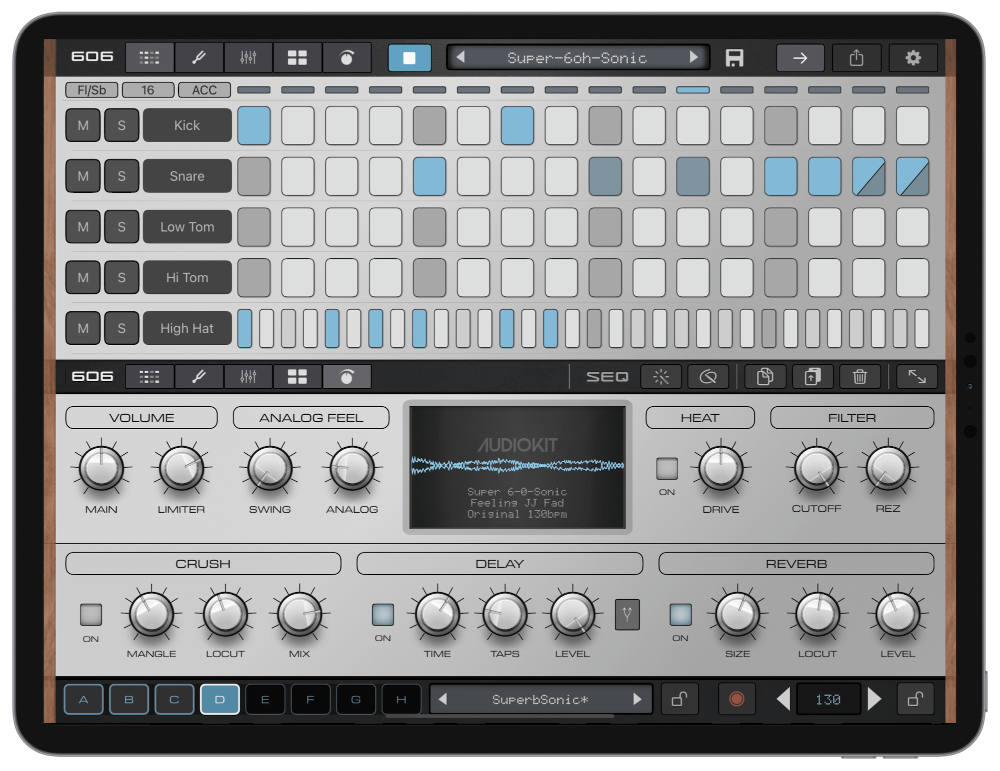

# 606 Inspired Synth Drums

See demos of the [SUPER 606 app](https://audiokitpro.com/super606).

Here's the DSP code behind the Super 606 XL "608" kick drum, synthesized snare, analog clap, analog toms, and melodic metallic hi-hats.


It's original modular C++ with no plugin  wrapper (no JUCE, etc). The dsp is synth based and contains no samples. Drop the headers into your audio project and connect them to whatever engine you already use.

The hi-hats are the clever part. Most drum synths start with a handful of square waves. These build the metal one partial at a time, which gives the strike a clearer note without losing the rough edges that make hardware hats feel alive. I haven't seen any other repos make synth hi-hats this way, so thought it was worth adding to the conversation.

## 606 Synth Snare

The snare is a 99% match for a hardware sample. Every drum hit is unique and different, like real analog hardware. 

The snare keeps the two useful parts separate. A short high-pitched shell gives it the note, then two bandpass filters shape the noise into the wire sound. I left a very quiet low ring under the noise so the two halves land as one drum.

- 🔊 [606 Hardware Snare Sample](https://audiokitpro.com/mp3/606_SampleSnare.wav)
- 🔊 [NEW SUPER 606 Snare](https://audiokitpro.com/mp3/606_SynthSnare.wav)

Decay closes the whole hit. Snappy only changes the wire level, and the optional noise color ratio moves the wires without moving the shell.

For another take on synth snare code, check out the excellent [Mutable Instruments Peaks Snare DSP](https://github.com/pichenettes/eurorack/tree/master/peaks/drums).

## Analog Clap

Clap is now a 99.9% match for the Analog RD-6. Since the original 606 never had a clap, the analog re-issue graciously lent its hand (claps) 👏. Yes, a synth clone from a synth clone. Clone Inception unlocked. Cloneception?

- 🔊 [Analog Hardware Clap](https://audiokitpro.com/mp3/606_SampleClap.wav)
- 🔊 [NEW SUPER 606 Clap](https://audiokitpro.com/mp3/606_SynthClap.wav)


## Analog Toms

The toms use a few quieter resonances around the main note instead of a single clean sine. The low tom falls into pitch over its first few cycles, while the high tom leaves a lower ring hanging behind the body.

- 🔊 [OG 1981 Analog 606 Lo Tom](https://audiokitpro.com/mp3/606_LT_Hardware_48k.wav)
- 🔊 [NEW SUPER 606 Lo Tom](https://audiokitpro.com/mp3/606_LT_NEW_OpenSource.wav)


## What's Inside?

- `BassDrum.hpp`:  A swept-sine body with filtered noise and impulse transients.
- `Clap.hpp`:  Four timed noise bursts and a diffuse tail shaped by short measurement-fitted FIR filters.
- `HiHats.hpp`:  One metallic source with separate closed and open hat settings.
- `Snare.hpp`:  A tom-like shell body with separate filtered-noise wires.
- `Toms.hpp`:  Separate low and high tom settings built around the same voice.
- `SynthDrumCommon.hpp`:  The filters, envelopes, noise, and other small pieces shared by the voices.

The code is header only and uses the C++14 standard library. Add the `Source` folder to your header search path and include whichever voices you need.

## Hooking it up

```cpp
#include "BassDrum.hpp"
#include "Clap.hpp"
#include "HiHats.hpp"
#include "Snare.hpp"
#include "Toms.hpp"

SynthDrums606::BassDrumVoice bassDrum;
SynthDrums606::ClapVoice clap;
SynthDrums606::MetalHiHatVoice hiHat;
SynthDrums606::SnareVoice snare;
SynthDrums606::TomVoice lowTom;
SynthDrums606::TomVoice highTom;

bassDrum.init(sampleRate);
clap.init(sampleRate);
hiHat.init(sampleRate);
snare.init(sampleRate, 0x6063u);
lowTom.init(sampleRate, 0x6061u);
highTom.init(sampleRate, 0x6062u);

// transient, decay, tuning in semitones, optional pitch variation
bassDrum.trigger(0.30f, 0.80f, 2.22f, 0.0f);

// decay, pitch ratio, Noise amount (0.5 is the fitted clap)
clap.trigger(0.80f, 1.0f, 0.50f);

// preset, decay, pitch ratio
hiHat.trigger(SynthDrums606::kClosedHatSpec, 0.70f, 1.0f);

// decay, body pitch ratio, Snappy, optional noise color ratio
snare.trigger(0.80f, 1.0f, 0.75f);

// low or high spec, decay, pitch ratio
lowTom.trigger(SynthDrums606::kLowTomSpec, 0.80f, 1.0f);
highTom.trigger(SynthDrums606::kHighTomSpec, 0.80f, 1.0f);

for (int frame = 0; frame < frameCount; ++frame) {
    float mono = bassDrum.process()
               + clap.process()
               + hiHat.process()
               + snare.process()
               + lowTom.process()
               + highTom.process();
    outputLeft[frame] += mono;
    outputRight[frame] += mono;
}
```

Each call to `process()` gives you one mono sample. Your host can handle gain, velocity, panning, choke behavior, and the rest of the mixing.

Use `kClosedHatSpec` or `kOpenHatSpec` when you trigger the hat. The tom voice works the same way with `kLowTomSpec` and `kHighTomSpec`. Each voice accepts a seed in `init()` if you want the little variations to repeat.

## Knobs

`BassDrumVoice::trigger()` wants:

- transient amount from 0 to 1
- decay from 0 to 1
- tuning in semitones
- optional pitch variation in semitones

`ClapVoice::trigger()` wants:

- decay from 0 to 1
- a pitch ratio, where 1 is the original tuning
- an optional Noise amount from 0 to 1; 0.5 is the fitted clap,
  lower settings remove colored noise, and higher settings add later air and density

`MetalHiHatVoice::trigger()` wants:

- a closed or open hat specification
- decay from 0 to 1
- a pitch ratio, where 1 is the original tuning

`SnareVoice::trigger()` wants:

- decay from 0 to 1
- a body pitch ratio, where 1 is the original tuning
- Snappy amount from 0 to 1
- an optional noise color ratio, where 1 is the original wire color

`TomVoice::trigger()` wants:

- a low or high tom specification
- decay from 0 to 1
- a pitch ratio, where 1 is the original tuning

All of the voices are made entirely in code.

## Legal Stuff

MIT. See `LICENSE`

This is an independent project inspired by classic analog drum-machine circuits for learning and education purposes. It is not affiliated with or endorsed by Roland Corporation, Behringer, or any other company or products noted.
